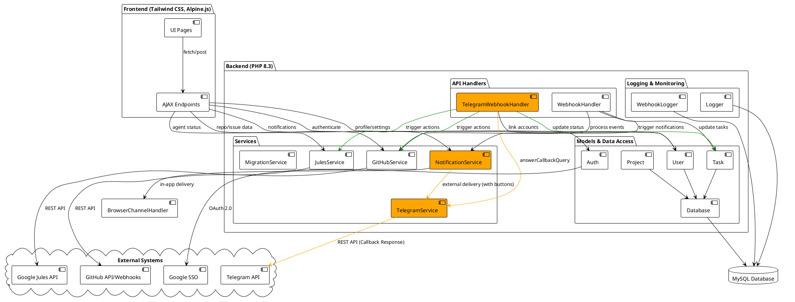

# Design: Telegram Chat Control

## Overview
Telegram Chat Control transforms the Telegram bot from a notification-only channel into an interactive management interface. It leverages Telegram's Inline Keyboards and Callback Queries to allow users to perform common task operations (Retry, Restart, Merge) directly from the chat.

## Architecture

### Component Diagram (Differential)
The following diagram highlights the changes required for Telegram Chat Control, based on the system architecture.
- **Orange**: Existing components requiring significant logic updates.
- **Green**: New components, interactions, or removed/deprecated flows (per requirement).



## Technical Details

### 1. Callback Query Handling
The `TelegramWebhookHandler` is extended to process `callback_query` updates.

```php
// Conceptual implementation in TelegramWebhookHandler.php
public function handle(array $update): bool {
    if (isset($update['callback_query'])) {
        return $this->handleCallback($update['callback_query']);
    }
    // ... existing message handling ...
}

private function handleCallback(array $callbackQuery): bool {
    $data = $callbackQuery['data']; // e.g., "retry:123"
    $chatId = $callbackQuery['message']['chat']['id'];

    // 1. Authenticate user by chatId
    // 2. Parse action and taskId
    // 3. Verify project permissions
    // 4. Execute action via GHS or JS
    // 5. Provide feedback via TelegramService::answerCallbackQuery
}
```

### 2. Inline Keyboards
The `NotificationService` now supports adding actions to notifications. These actions are translated by `TelegramChannelHandler` into `InlineKeyboardMarkup`.

**Button Data Format:**
- `retry:{taskId}`
- `restart:{taskId}`
- `merge:{taskId}`

### 3. Security and Permissions
- **User Verification**: Every callback query must come from a `chat_id` linked to a valid `user_id` in the database.
- **Resource Authorization**: The system verifies that the authenticated user has appropriate permissions (e.g., is an owner or collaborator) for the project associated with the `taskId` before executing any action.

### 4. User Feedback Loop
- **Immediate Ack**: `answerCallbackQuery` is used to show a "Loading..." state or a toast notification in Telegram.
- **Completion Update**: Once the action (like a retry) is initiated, the bot should ideally update the original message to reflect the new state (e.g., "🔄 Retrying task...") using `editMessageText`.

## Use Case Realization

### [UC-C1] Remote Task Recovery
1.  `Task::refreshJulesStatus` detects a failure.
2.  `NotificationService` triggers a notification with `['actions' => ['retry', 'restart']]`.
3.  `TelegramChannelHandler` sends a message with buttons.
4.  User taps "Retry".
5.  `TelegramWebhookHandler` receives `retry:{id}`, calls `JulesService::retry()`, and notifies the user of success.

### [UC-C2] One-Tap PR Merging
1.  GitHub Webhook reports CI success on a PR.
2.  `NotificationService` triggers a notification with `['actions' => ['merge']]`.
3.  User taps "Merge & Close".
4.  `TelegramWebhookHandler` receives `merge:{id}`, calls `GitHubService::mergePullRequest()`, then closes the issue.
