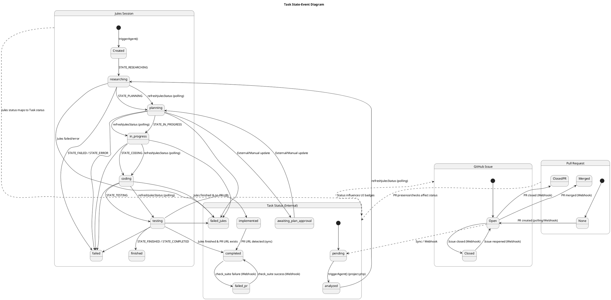

# Concept: On-Event and On-State Behaviors

This document describes the reactive behaviors of the Agent Control application, detailing how it responds to external events and how it behaves based on its internal state.

## 1. State-Event Diagram

The following diagram illustrates the transitions between different states for GitHub Issues, Jules Sessions, and internal Task Statuses.

## 2. On-Event Behaviors

These behaviors are triggered by specific events originating from GitHub (webhooks), user interactions, or periodic polling.

### 2.1 GitHub Webhooks

| Event | Action |
| :--- | :--- |
| **Issue Labeled (`Jules`)** | Triggers `App\Task::triggerAgent()`. Internal status moves to `analyzed`. |
| **Issue Closed** | Updates `github_state` to `closed`. May trigger "Auto-Repeat" if applicable. |
| **Issue Reopened** | Updates `github_state` to `open`. |
| **Issue Deleted** | Triggers a notification and removes the task from the local database. |
| **Pull Request Created** | Links the PR to the task. Internal status may move to `completed` if work was `implemented`. |
| **Pull Request Merged** | Triggers "Auto-Repeat" logic if the issue has the `Auto-Repeat` label. |
| **Check Suite Completed** | If `success`, moves `failed_pr` status back to `completed`. If `failure/timeout`, moves status to `failed_pr`. |

### 2.2 User Interactions (UI)

| Action | Effect |
| :--- | :--- |
| **Manual Sync (Refresh Icon)** | Forces a synchronization of GitHub issues and Jules statuses for the project. |
| **Trigger Agent (Button)** | Manually starts a Jules session for a task. |
| **Merge & Close (Button)** | Merges the associated PR and closes the GitHub issue via API. |
| **Retry (Button)** | Sends a "retry" command to a failed Jules session. |
| **Restart (Button)** | Aborts the current Jules session and restarts it by toggling the `Jules` label. |

### 2.3 Jules Status Polling

Periodic calls to `App\Task::refreshJulesStatus` update the internal task status based on the remote Jules session state:

- `STATE_RESEARCHING` -> `researching`
- `STATE_PLANNING` -> `planning`
- `STATE_IN_PROGRESS` -> `in_progress`
- `STATE_CODING` -> `coding`
- `STATE_TESTING` -> `testing`
- `STATE_FINISHED` / `STATE_COMPLETED` -> `completed` (if PR exists) or `implemented` (if no PR yet)
- `STATE_FAILED` / `STATE_ERROR` -> `failed_jules`

## 3. On-State Behaviors

The system exhibits different behaviors and UI representations depending on the current state of a task.

### 3.1 Task Status Visuals (Dashboard/Project List)

- **`pending` / `analyzed`**: Displayed as "Waiting for Agent" or "Analyzing".
- **`researching` / `planning` / `coding` / `testing`**: Displayed with a yellow/spinning indicator to show Jules is active.
- **`implemented`**: Yellow indicator, showing work is done but PR checks are pending or PR is not yet merged.
- **`completed`**: Green checkmark, indicating work is done and PR is in good standing (or closed).
- **`failed_jules` / `failed_pr`**: Red error indicator, highlighting that human intervention is needed.

### 3.2 Feature Availability

- **Merge & Close**: Only available if `status` is `completed`, a PR exists, it is mergeable, not a draft, and checks have passed.
- **Retry / Restart**: Only available when status is `failed_jules`.

## 4. Automation Rules

Detailed automation logic as defined in `AUTOMATION_CONCEPT.md`:

### 4.1 Auto-Repeat
Triggered when a PR associated with an issue labeled `Auto-Repeat` is closed. A new issue is created with the same title/body and the `Jules` label, but without the `Auto-Repeat` label.

### 4.2 PR Monitoring
The system continuously monitors the `check_suite` status of open PRs. Any failure automatically transitions the task to `failed_pr` to alert the user.
