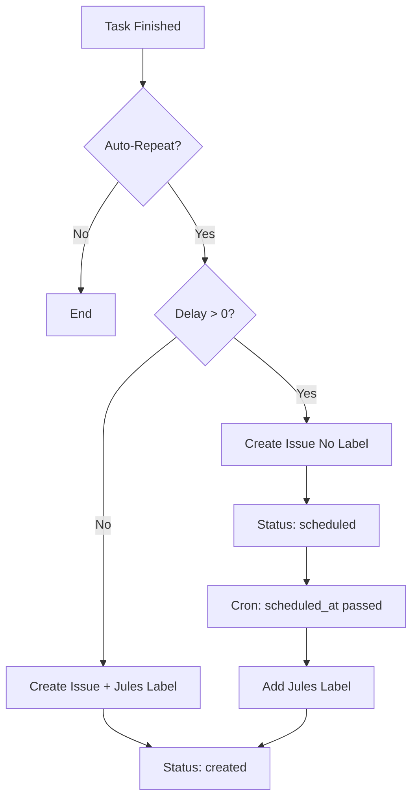

# Design: Task Countdown & Delayed Auto-Repeat

## Overview
The "Temporal Countdown" mechanism extends the existing Auto-Repeat feature by introducing time-based delays between task iterations. This allows for scheduled periodic tasks (e.g., daily audits, weekly syncs) without requiring external scheduling tools.

## 1. Database Schema Changes

A new migration `src/sql/020_add_autorepeat_delay_and_scheduled_at_to_tasks.sql` will introduce the following columns to the `tasks` table:

| Column | Type | Default | Description |
| :--- | :--- | :--- | :--- |
| `autorepeat_delay` | `INT` | `0` | Delay in seconds between iterations. |
| `scheduled_at` | `DATETIME` | `NULL` | The timestamp when the next iteration should be triggered. |

## 2. Backend Implementation

### 2.1 Webhook & Duplication Logic (`App\WebhookHandler`)

The `maybeDuplicateTask` method will be updated to respect the `autorepeat_delay`:

1.  **Detection**: Check if `autorepeat_remaining > 0` and `autorepeat` label is present.
2.  **Delay Calculation**:
    - If `autorepeat_delay > 0`:
        - Calculate `scheduled_at = NOW() + autorepeat_delay`.
        - Set `status = 'scheduled'`.
        - **Crucial**: Do NOT add the `Jules` label to the new GitHub issue yet.
    - Else:
        - Add `Jules` label immediately.
        - Set `status = 'created'`.
3.  **Persistence**: Call `Task::upsert` with the new fields.

### 2.2 Scheduled Task Processor (`App\Task`)

A new method `processScheduledTasks()` will be added to the `Task` class:

1.  **Query**: Fetch all tasks where `status = 'scheduled'` and `scheduled_at <= NOW()`.
2.  **Execution**: For each task:
    - Call `GitHubService::addLabel(repo, number, 'Jules')`.
    - Update task status to `created`.
    - Clear `scheduled_at` (set to `NULL`).
    - Log the trigger event: "Scheduled task triggered after [X] seconds delay."

### 2.3 Periodic Trigger (`src/frontend/cronjob.php`)

The global cron job will be updated to call the scheduled task processor:

```php
$taskModel->processScheduledTasks($scopedGithubService, $notificationService);
```

This ensures that even if no webhooks are received, scheduled tasks are released exactly when their delay expires.

## 3. API Integration

### 3.1 `api/openapi.yaml`
Update the `Task` schema to include:
- `autorepeat_delay` (integer, seconds).
- `scheduled_at` (string, ISO-8601).

### 3.2 Endpoint Updates
- `GET /api/task.php`: Return the new fields.
- `POST /api/task.php`: Support updating `autorepeat_delay`.

## 4. Next-Gen UI (React)

### 4.1 Task Detail View (`TaskDetailView.tsx`)
- **Configuration**: Add an "Auto-Repeat Delay" section.
    - Use a numeric input with a unit selector (Minutes, Hours, Days).
    - Convert selected units to seconds for API storage.
- **Status Display**: If a task is in `scheduled` state:
    - Display a "Scheduled" badge (e.g., orange/brown).
    - Render a `CountdownTimer` component showing "Next run in: HH:MM:SS".

### 4.2 Dashboard & Autorepeat Table
- Update `AutorepeatTasks` component to show the countdown timer in the "Status" column for scheduled tasks.
- Allow users to manually "Trigger Now" a scheduled task, which bypasses the delay and adds the `Jules` label immediately.

## 5. State Transition Flow


