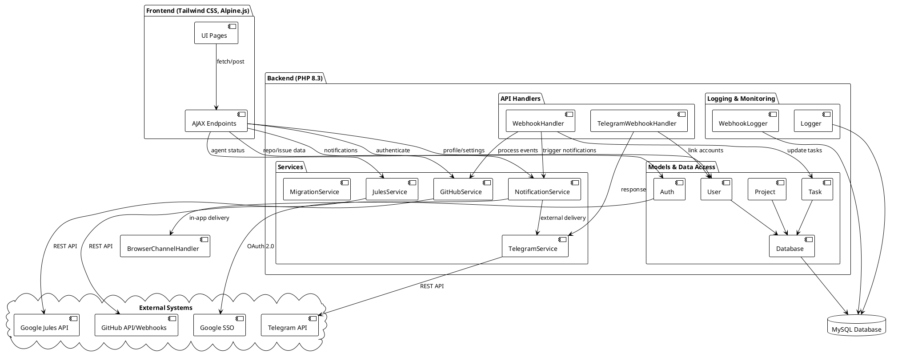

# Design: Agent Control PHP Application

## Architecture
The application follows a modular architecture, separating concerns between the presentation layer, business logic, and data access.

### Component Diagram
The following diagram illustrates the high-level components and their interactions:

## Tech Stack
- **Development & Production**:
    - **Language**: PHP 8.3+
    - **Server**: PHP-compatible web server (e.g., Apache, Nginx)
    - **Database**: MySQL
    - **Frontend**: Tailwind CSS (Responsive UI), Alpine.js (Interactivity)
    - **Authentication**: Google SSO via `google/apiclient`
    - **API Integration**:
        - **GitHub**: `knplabs/github-api`
        - **Google Jules**: `guzzlehttp/guzzle` (REST API client)
        - **Telegram**: `guzzlehttp/guzzle` (for webhook responses and API calls)
- **Testing**:
    - **CI/CD**: GitHub Actions
    - **Tools**: PHPUnit for unit testing, Mocking libraries for API responses

## Data Model
- **Users**: Stores user profiles, Google SSO identifiers, and associated GitHub account tokens.
- **Projects**: Links users (via their connected GitHub accounts) to GitHub repositories.
- **Agents**: Configurable agent definitions and their capabilities.
- **Tasks**: Logs of agent activities, linked to GitHub issues and project progress.

## API Integration Strategy
- **GitHub**: Use webhooks to listen for issue events and the REST API to fetch details and post updates.
- **Google Jules**: Utilize secure API calls to trigger and manage agent sessions.
- **Google SSO**: Implement OAuth 2.0 flow for secure user authentication.
- **Telegram**: Implement webhook handler with secret token validation and asynchronous processing using `fastcgi_finish_request()`.

### Telegram Integration Details
- **TelegramService**: A wrapper for the Telegram Bot API using Guzzle. It handles outgoing messages, supporting HTML parse mode and custom bot tokens.
- **TelegramWebhookHandler**: Processes incoming updates from Telegram. It validates the webhook secret and handles commands like `/start` for account linking.
- **Secure Linking Flow**:
  1. User clicks "Link Telegram" in the dashboard.
  2. A random `telegram_link_token` is generated and stored in the `users` table.
  3. User is directed to the Telegram bot with the token as a parameter (e.g., `/start <token>`).
  4. The bot receives the token, matches it to the user, and stores the `telegram_chat_id` in the `user_telegram_accounts` table.
  5. The `telegram_link_token` is cleared upon successful linking.

## Security
- Secure storage of API tokens using environment variables.
- Input validation and sanitization for all user-provided data.
- Session management for authenticated users.

## Sub-Designs
Detailed architectural and technical designs for specific features can be found in the following documents:
- [**Telegram Chat Control Design**](CHAT_DESIGN.md): Callback handling, inline keyboards, and mobile interaction logic.
- [**Notification System Design**](NOTIF_DESIGN.md): Service architecture, delivery channel implementations, and database schema.
