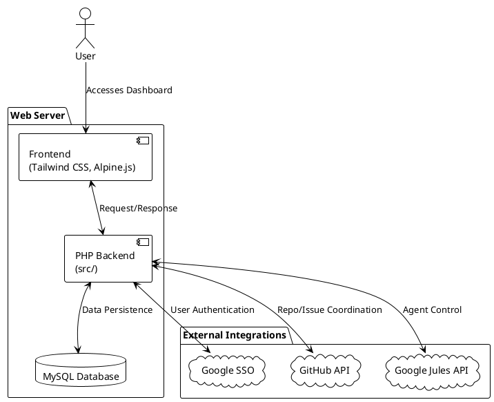

# Agent Control PHP Application

## Overview
A PHP application to control agents from Google Jules, coordinated by GitHub repositories and issues. It provides a centralized platform for managing AI agent workflows through a unified web interface.

## Architecture


## Features
- **Centralized Agent Management**: Coordinate multiple AI agents across projects.
- **GitHub Integration**: Link repositories and issues to specific agent tasks.
- **Secure Authentication**: Google SSO for multi-user management.
- **Workflow Automation**: Trigger agent actions directly from project management tools.

## Getting Started

### Requirements
- PHP 8.3+
- MySQL
- Composer

### Installation
1. Clone the repository.
2. Install dependencies:
   ```bash
   ./src/install.sh
   ```
3. Set up your environment variables (DB_HOST, DB_NAME, DB_USER, DB_PASS, GOOGLE_CLIENT_ID, GOOGLE_CLIENT_SECRET, GOOGLE_REDIRECT_URI).
4. Initialize the database using `src/schema.sql`.

### Local Development
Start the local development server:
```bash
php -S localhost:8080 -t public
```

## Project Structure
- `public/`: Web entry points (index.php, login.php, etc.).
- `src/`: Core PHP logic and classes.
- `test/`: PHPUnit tests and testing tools.
- `docs/`: Additional documentation and mockups.
- `CONCEPT.md`, `DESIGN.md`, `GEMINI.md`, `ROADMAP.md`: Project documentation.

## Documentation
- [Concept](CONCEPT.md)
- [Design](DESIGN.md)
- [Gemini Project Goal](GEMINI.md)
- [Roadmap](ROADMAP.md)
