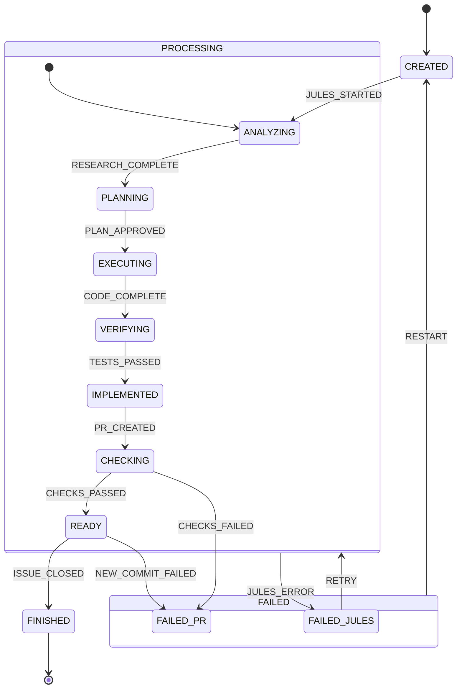

# Task State Machine (XState)

This document describes the task lifecycle defined in [STATE_EVENTS_CONCEPT.md](../STATE_EVENTS_CONCEPT.md) using the [XState](https://xstate.js.org/) v5 specification and Mermaid diagrams.

## 1. Visual Representation (Mermaid)



## 2. XState Machine Definition (v5)

```javascript
import { createMachine } from 'xstate';

/**
 * Task State Machine
 * Represents the unified lifecycle of a Jules Task.
 */
export const taskMachine = createMachine({
  id: 'task',
  initial: 'CREATED',
  states: {
    CREATED: {
      on: {
        JULES_STARTED: 'PROCESSING.ANALYZING',
        JULES_ERROR: 'FAILED.FAILED_JULES',
        ISSUE_CLOSED: 'FINISHED'
      }
    },
    PROCESSING: {
      initial: 'ANALYZING',
      states: {
        ANALYZING: {
          on: {
            RESEARCH_COMPLETE: 'PLANNING',
          }
        },
        PLANNING: {
          on: {
            PLAN_APPROVED: 'EXECUTING',
          }
        },
        EXECUTING: {
          on: {
            CODE_COMPLETE: 'VERIFYING',
          }
        },
        VERIFYING: {
          on: {
            TESTS_PASSED: 'IMPLEMENTED',
          }
        },
        IMPLEMENTED: {
          on: {
            PR_CREATED: 'CHECKING',
          }
        },
        CHECKING: {
          on: {
            CHECKS_PASSED: { target: '#task.READY' },
            CHECKS_FAILED: { target: '#task.FAILED.FAILED_PR' }
          }
        }
      },
      on: {
        JULES_ERROR: 'FAILED.FAILED_JULES',
        ISSUE_CLOSED: 'FINISHED'
      }
    },
    READY: {
      on: {
        ISSUE_CLOSED: 'FINISHED',
        NEW_COMMIT_FAILED: 'FAILED.FAILED_PR'
      }
    },
    FAILED: {
      initial: 'FAILED_JULES',
      states: {
        FAILED_JULES: {
          on: {
            RETRY: { target: '#task.PROCESSING' }
          }
        },
        FAILED_PR: {}
      },
      on: {
        RESTART: { target: 'CREATED' },
        ISSUE_CLOSED: 'FINISHED'
      }
    },
    FINISHED: {
      type: 'final'
    }
  }
});
```

## 3. Mapping to Implementation

The machine states map to the following constants in `App\Task`:

- `CREATED`: `STATUS_CREATED`
- `PROCESSING.ANALYZING`: `STATUS_ANALYZING`
- `PROCESSING.PLANNING`: `STATUS_PLANNING`
- `PROCESSING.EXECUTING`: `STATUS_EXECUTING`
- `PROCESSING.VERIFYING`: `STATUS_VERIFYING`
- `PROCESSING.IMPLEMENTED`: `STATUS_IMPLEMENTED`
- `PROCESSING.CHECKING`: `STATUS_CHECKING`
- `READY`: `STATUS_READY`
- `FINISHED`: `STATUS_FINISHED`
- `FAILED.FAILED_JULES`: `STATUS_FAILED_JULES`
- `FAILED.FAILED_PR`: `STATUS_FAILED_PR`
